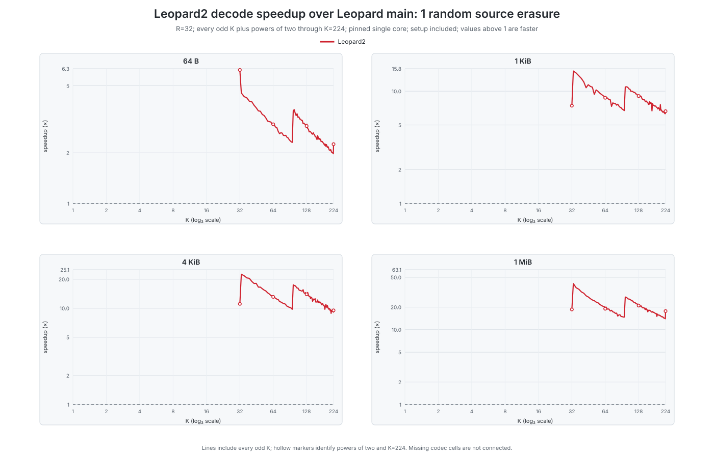
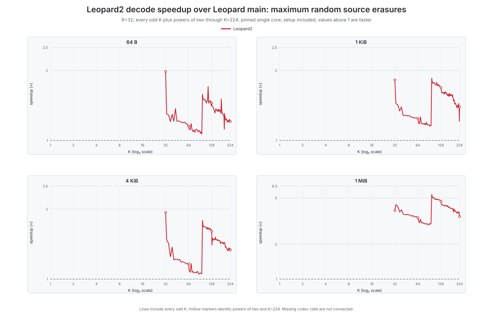

# Leopard-RS

Leopard-RS is a portable C/C++ library for systematic Reed–Solomon erasure
coding. Leopard2 adds an object-based API while preserving the original
`leopard.h` API and wire format. It generates parity shards and recovers lost
data shards for codes with up to 65,535 originals (with one recovery shard).

## Quick start

Requirements: CMake 3.16 or newer, a C99/C++11 compiler, and OpenMP for the
parallel context. A portable release build needs no CPU-specific flags:

```sh
cmake -S . -B build -DCMAKE_BUILD_TYPE=Release
cmake --build build
(cd build && ctest --output-on-failure)
```

The smallest Leopard2 program includes [`leopard2.h`](leopard2.h), creates a
context with `leo2_context_create`, creates a codec with `leo2_codec_create`,
queries scratch with `leo2_encode_scratch_size`, and calls `leo2_encode`.
Recovery uses `leo2_decode_plan_create` and `leo2_decode_plan_execute`. The
[minimal example](examples/leopard2_minimal.c), [API guide](docs/leopard2_api.md),
and header document signatures, layouts, alias rules, and errors.

After building, compile and run the example on POSIX systems with GCC:

```sh
cc -std=c11 -I. -c examples/leopard2_minimal.c -o build/leopard2_minimal.o
c++ build/leopard2_minimal.o build/libleopard.a -fopenmp -o build/leopard2_minimal
build/leopard2_minimal
```

`LEO2_BACKEND_AUTO` is recommended. Applications may explicitly request
`SCALAR`, `SSSE3`, `AVX2`, `AVX512`, or `GFNI`; an explicit request never
silently widens to another ISA. GF16 odd payloads require the explicit padded
odd layout. See [Windows build notes](docs/leopard2_windows_build.md) for the
legacy Visual Studio project and CMake workflow.

## Performance evidence

Read the results in this order:

- **Shipped in `master`:** On the calibrated AMD family 1Ah/model 08h host,
  AUTO includes [qualified GF16/GFNI routes](docs/leopard2_gfni_codec.md) for
  `K=1000,R=200` at 32 or 64 KiB and `K=1000,R=199` at 64 KiB. The two new
  boundary routes measured 1.537× and 1.484× versus their previous AUTO
  routes (53.7% and 48.4%); `R=199` at 32 KiB is still default-off.
- **Measured context:** the checked-in [performance atlas](docs/performance/leopard2_atlas/README_PERFORMANCE.md)
  compares single-core, AVX2-restricted Leopard2 with AVX2-restricted
  Leopard1. It shows size trends, not native-Leopard1 release guarantees.
- **Historical GF(2¹⁶) snapshot:** snapshot `a5d0229` at `K=1000,R=200,B=65536`
  measured 1.419× encode versus native Leopard1 (95% CI 1.325–1.520). It
  predates later codec and Walsh-locator changes, so it is **not final-release
  evidence**: [plot](docs/performance/leopard2_atlas/plots/final_native_gfni_encode_speedup.svg)
  · [record](docs/performance/final_native_gfni_summary.json).

Only the shipped routes above affect defaults. The [current-native timing
attempt](docs/performance/native_release_encode_timing_v1.md) and the
[R199/32-KiB limitation](docs/performance/r19932_successor_v5.md) are retained
research records: both were inconclusive, changed no selector, and are not
product performance claims.

Representative plots:

- [AVX2-restricted encode comparison](docs/performance/leopard2_atlas/plots/encode_speedup_vs_leopard1.svg)
- [AVX2-restricted one-loss decode](docs/performance/leopard2_atlas/plots/decode_one_speedup_vs_leopard1.svg)
- [AVX2-restricted full-loss decode](docs/performance/leopard2_atlas/plots/decode_full_speedup_vs_leopard1.svg)
- [Native GFNI encode, snapshot a5d0229](docs/performance/leopard2_atlas/plots/final_native_gfni_encode_speedup.svg)
- [Snapshot throughput, setup, and memory](docs/performance/leopard2_atlas/plots/final_native_gfni_metrics.svg)

The following views make the Leopard1-versus-Leopard2 comparison visible in
the README. Each graph has one panel for each measured shard size (64 B,
1 KiB, 4 KiB, and 1 MiB); values above 1× mean Leopard2 is faster. These are
the same AVX2-restricted atlas measurements linked above, so they show size
trends but are not native-Leopard1 release claims.






The dense GF16 decode-plan locator has a separately qualified AVX2 setup path:
the same-process screen measured 3.9×–18.6× lower setup time across six
active-parent sizes. This is setup-only evidence, not an end-to-end throughput
claim; see the [method](docs/performance/gf16_walsh_locator_avx2_preregistration_v2.md),
[results](docs/performance/gf16_walsh_locator_avx2_v2.md), and
[machine-readable record](docs/performance/gf16_walsh_locator_avx2_v2.json).
Benchmark hardware, workloads, gates, and reproduction commands are recorded
with each atlas and experiment report.

## Decoder profiles

Leopard1's public API accepted only the high-rate shape `R <= K`. Leopard2
keeps that legacy-high profile (and its compatible parity where tested) and
adds a low-rate profile for `R > K`. AUTO selects high-rate when `R <= K` and
low-rate otherwise. Both profiles accept positive, non-power-of-two `K` and
`R` through shortening and puncturing; the maximum transmitted code length is
unchanged at `K + R <= 65536`.

The decoder algorithms follow the low/high LCH-FFT constructions in Chen et al.
(see [References](#references)). AUTO uses the message-side transform for the
low-rate profile and the redundancy-side transform for high-rate. Field AUTO
uses GF8 for parents through 256 coordinates and GF(2¹⁶) for larger parents,
up to 65,536 coordinates. These are parameter-range and decoder-path
extensions, not a larger field or shard-count limit.

## Portable builds and backend policy

The default CMake build is runtime-dispatched and does not add `-march=native`.
Baseline x86-64 code stays at SSE2; SSSE3, AVX2, AVX-512VL, and GFNI kernels
are separate translation units selected only after CPU and OS checks. Do not
use `-march=native` when distributing binaries to other machines.

On the calibrated AMD family 1Ah/model 44h host class, AUTO may use the
qualified AVX-512VL legacy-high full-output encode for `K >= 8`, `N >= 16`,
`2 <= R <= 4096`, and 64-byte-aligned shard lengths from 64 bytes through
4 MiB. On AMD family 1Ah/model 08h, a qualified 256-bit GFNI table serves
native legacy-high `K=1000,T=256`, single-thread full-output encoding and the
ordinary one-item batch path for exactly these recovery counts and shard sizes:
`R=200` at 32 or 64 KiB, and `R=199` at 64 KiB. `R=199` at 32 KiB remains
disabled. Other shapes, decode, reusable/scalable batches, unknown CPUs, and
explicit backends retain their normal tables and fallbacks.

`LEO2_BACKEND_VARIANT=auto|scalar|ssse3|avx2|avx512` is a diagnostic control,
not a portability target or wire-format choice. Release builds can run the
strict x86-64 archive audit with:

```sh
cmake -S . -B build/release-audit -G Ninja \
  -DCMAKE_BUILD_TYPE=Release -DCMAKE_EXPORT_COMPILE_COMMANDS=ON \
  -DLEO2_PORTABLE_ISA_RELEASE_AUDIT=ON
cmake --build build/release-audit --target leopard
(cd build/release-audit && ctest -R '^leopard2_portable_isa$' --output-on-failure)
```

## Fields and reduced builds

`LEO2_FIELD_AUTO` is a wire-stable convenience: it chooses GF8 for small
power-of-two parents (at most 256 coordinates) and GF16 otherwise. Both fields
are included by default; a reduced build may disable one:

```sh
cmake -S . -B build-gf8 -DLEOPARD_ENABLE_GF16=OFF
cmake -S . -B build-gf16 -DLEOPARD_ENABLE_GF8=OFF
```

At least one field must remain enabled. GF8 accepts arbitrary positive shard
lengths. Native GF16 requires complete two-byte symbols; an odd physical size
returns `LEO2_UNSUPPORTED`. For an odd application payload, use
`LEO2_SHARD_LAYOUT_GF16_PADDED_ODD_V1` and retain the extra physical byte in
every parity shard.

## Legacy API and release contents

The original `leo_*` API remains available through [`leopard.h`](leopard.h),
with its historical compatibility and layout rules. Older API details and
benchmark history are in [`Benchmarks.md`](Benchmarks.md); the new API contract
is in [`docs/leopard2_api.md`](docs/leopard2_api.md).

User source archives contain library sources, headers, CMake files, tests,
examples, benchmark tooling, portability support, license, documentation, and
the lightweight atlas runner. Research bundles, generated builds, and session
metadata remain in Git history but are excluded from archives; see
[`docs/release_distribution.md`](docs/release_distribution.md).

## References

The algorithms and finite-field implementation draw on these papers:

1. S.-J. Lin, T. Y. Al-Naffouri, Y. S. Han, and W.-H. Chung, “Novel
   Polynomial Basis with Fast Fourier Transform and Its Application to
   Reed-Solomon Erasure Codes,” *IEEE Transactions on Information Theory*,
   62(11), 6284–6299 (2016). [Paper PDF](docs/NovelPolynomialBasisFFT2016.pdf)
   · [arXiv:1404.3458](https://arxiv.org/abs/1404.3458)
2. D. G. Cantor, “On arithmetical algorithms over finite fields,” *Journal of
   Combinatorial Theory, Series A*, 50(2), 285–300 (1989).
3. Sian-Jheng Lin and Wei-Ho Chung, “An Efficient (n, k) Information
   Dispersal Algorithm for High Code Rate System over Fermat Fields,” *IEEE
   Communications Letters*, 16(12), 2036–2039 (2012).
4. J. S. Plank, K. M. Greenan, and E. L. Miller, “Screaming fast Galois Field
   arithmetic using Intel SIMD instructions,” in *FAST 2013*. [Paper PDF](docs/plank-fast13.pdf)
5. Chao Chen et al., “Two Fast Erasure Decoding Algorithms for Reed-Solomon
   Codes Based on LCH-FFT,” *IT2026*. [Paper PDF](https://i4ai.org/hanyunghsiang/IT2026.pdf)

The [extended literature and source bibliography](docs/leopard2_math_and_sources.md)
records additional related work and comparison implementations. The related
[XDRS implementation](https://github.com/fastecc/xdrs) is a reference project,
not a paper; its coordinate and wire conventions differ from Leopard2. A more
detailed algorithm comparison is in
[`docs/leopard2_it2026_algorithm_audit.md`](docs/leopard2_it2026_algorithm_audit.md).

## Credits

Inspired by discussion with:

- Sian-Jhen Lin <sjhenglin@gmail.com>: author of references 1 and 3, and the
  basis for Leopard
- Bulat Ziganshin <bulat.ziganshin@gmail.com>: author of [FastECC](https://github.com/Bulat-Ziganshin/FastECC)
- Yutaka Sawada <tenfon@outlook.jp>: author of [MultiPar](https://github.com/YutakaSawada/MultiPar)

Software by Christopher A. Taylor <mrcatid@gmail.com>.

Please reach out if you need support or would like to collaborate on a project.
