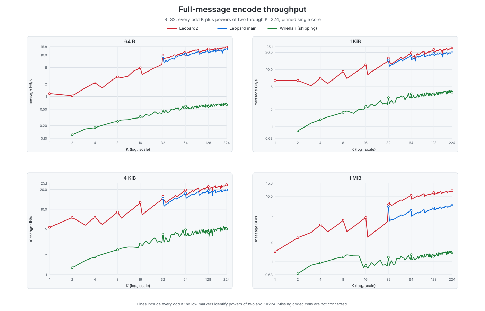
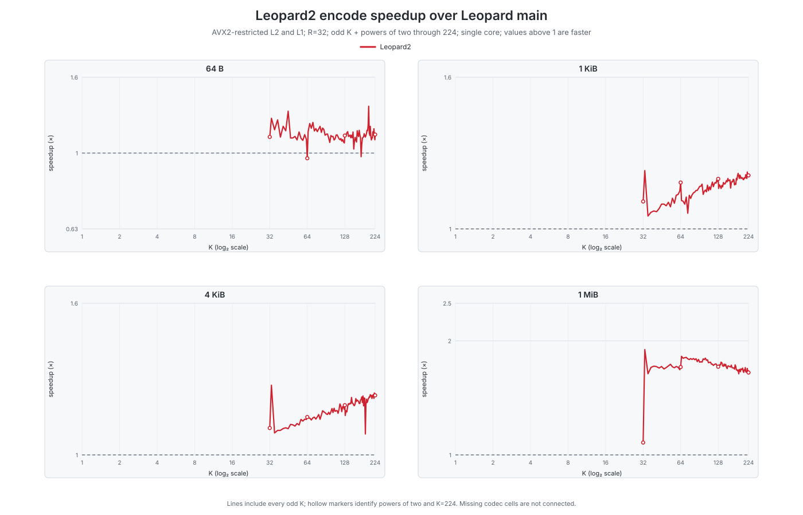
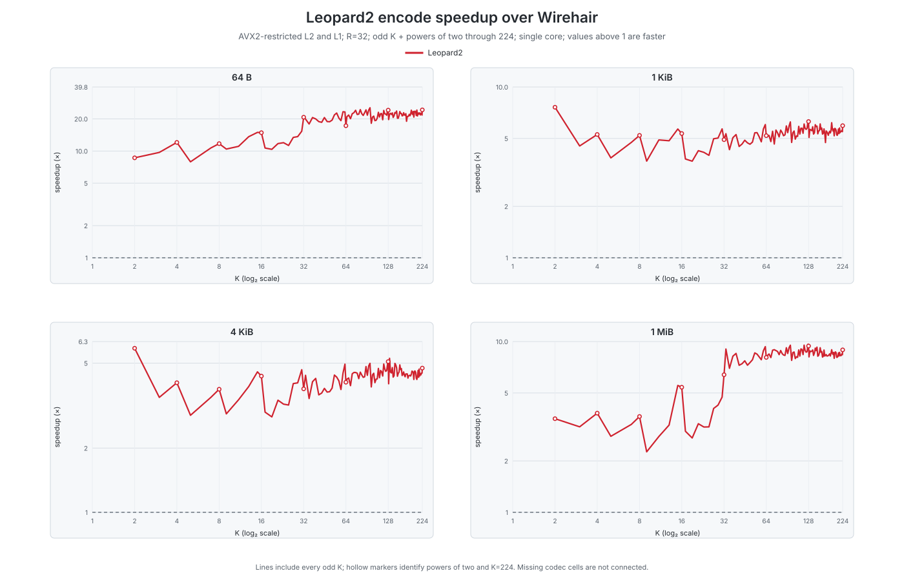
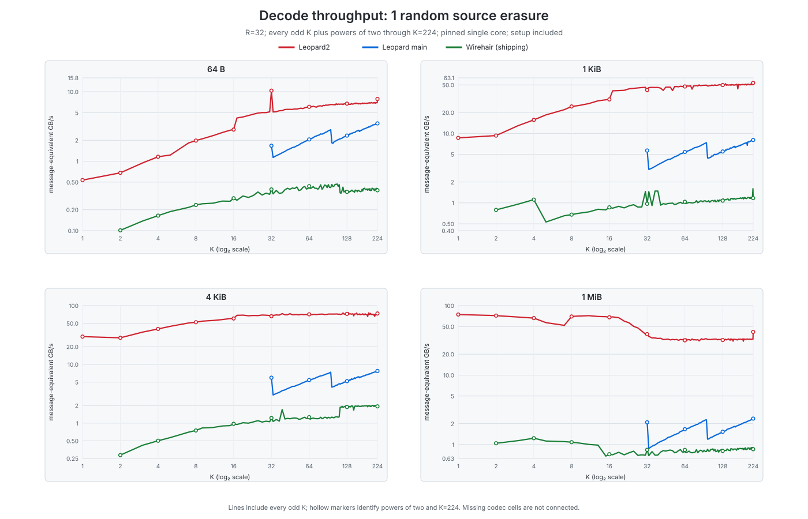
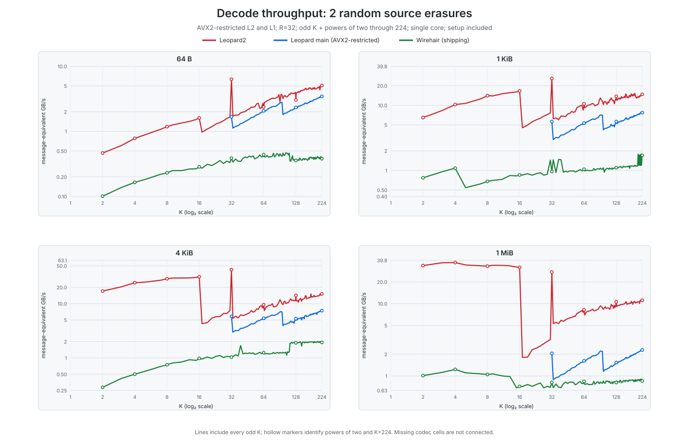
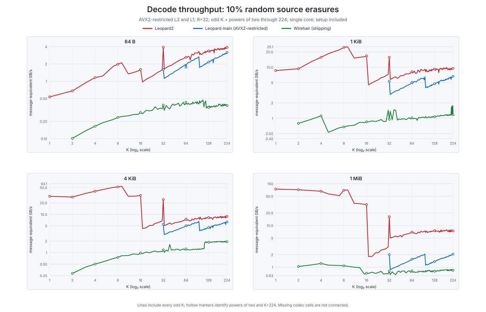
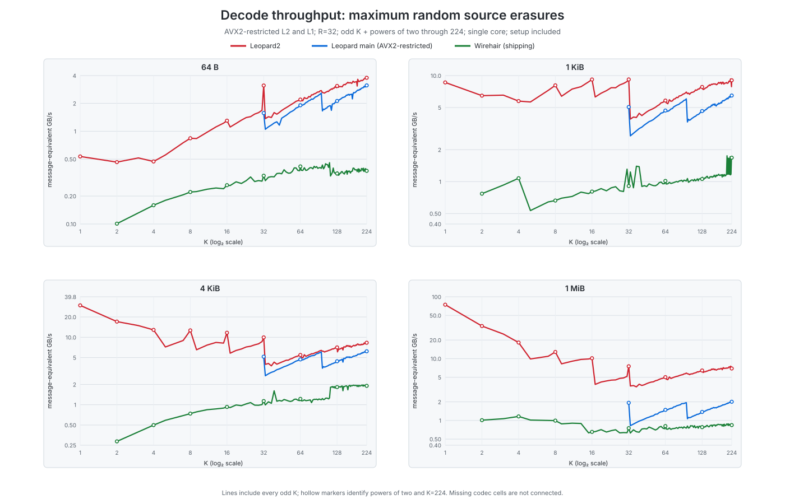

# Leopard2 performance atlas

This atlas compares Leopard2 against the exact Leopard `main` baseline and the
shipping Wirehair codec over **120 K values**, **four shard sizes**, and **four
source-erasure regimes**. It contains 1,852 unique workload
cells and 5,300 validated codec results. All graphs are
generated from the checked-in machine-readable evidence; unavailable cells are
left blank rather than interpolated.

> Values above 1× in speedup graphs mean Leopard2 is faster. These are
> single-core results on one recorded host, not universal performance claims.

## Artifact identity

This release refresh was measured from Leopard2 commit `150e38dd1d55bb31c32aeced9254d33979b67dce`
(tree `d3d4b82b767403f783134b2c257bf0e074cf08f8`), against exact Leopard
`main` commit `6e5725ebdf9da4370b0bcc4f70fa8eb66f4e6198` and Wirehair commit
`067ca7cdb66aed424ec23f97557429bf791c6f0c`. The executable SHA-256 values,
compiler, host, manifest, and raw results are recorded in
[`run_metadata.json`](run_metadata.json), [`manifest.json`](manifest.json),
and [`summary.json`](summary.json). The superseded 2026-08-18 atlas remains
available in [`historical/2026-08-18`](historical/2026-08-18/README_PERFORMANCE.md).
The separate AUTO R199/32 KiB diagnostic remains disabled after a valid
resource-captured successor found positive target gains but failed its fixed
control gate; see the [limitation report](../r19932_successor_v5.md).

## Headline graphs

### Encoding

| Baseline | Comparable cells | Median full-message speedup | Cells faster |
| --- | --- | --- | --- |
| Leopard main | 400 | 1.155× | 99.5% |
| Wirehair (shipping) | 476 | 5.743× | 100.0% |

### Decode with setup included

| Loss regime | Baseline | Comparable cells | Median speedup | Cells faster | Worst observed cell |
| --- | --- | --- | --- | --- | --- |
| 1 random source erasure | Leopard main | 400 | 10.110× | 100.0% | K=223, 64 B, 1.975× |
| 1 random source erasure | Wirehair (shipping) | 476 | 38.556× | 100.0% | K=5, 64 B, 6.511× |
| 2 random source erasures | Leopard main | 400 | 2.061× | 100.0% | K=91, 64 B, 1.035× |
| 2 random source erasures | Wirehair (shipping) | 476 | 9.855× | 100.0% | K=19, 1 MiB, 2.389× |
| 10% random source erasures | Leopard main | 400 | 1.639× | 100.0% | K=73, 64 B, 1.084× |
| 10% random source erasures | Wirehair (shipping) | 476 | 8.082× | 100.0% | K=19, 1 MiB, 2.389× |
| maximum random source erasures | Leopard main | 400 | 1.457× | 100.0% | K=87, 4 KiB, 1.051× |
| maximum random source erasures | Wirehair (shipping) | 476 | 6.842× | 100.0% | K=39, 4 KiB, 2.665× |

## Complete graph index

Encoding:

- [Full-message throughput](plots/encode_execution_message_gbps.svg)
- [Parity/repair-output throughput](plots/encode_execution_output_gbps.svg)
- [Full-message latency](plots/encode_execution_latency_us.svg)
- [Speedup over Leopard main](plots/encode_speedup_vs_leopard1.svg)
- [Speedup over Wirehair](plots/encode_speedup_vs_wirehair.svg)
- [Wirehair marginal repair-output throughput (precode excluded)](plots/wirehair_marginal_repair_output_gbps.svg)
- [Wirehair marginal repair-output latency (precode excluded)](plots/wirehair_marginal_repair_latency_us.svg)

Each decode regime has setup-inclusive message throughput, received-input and
repaired-output throughput, latency, repeated-call/Leopard2-plan throughput,
Leopard-main speedup, Wirehair speedup, and Wirehair overhead plots:

- **1 random source erasure:** [setup-inclusive message throughput](plots/decode_one_first_message_gbps.svg), [repaired throughput](plots/decode_one_first_repaired_gbps.svg), [received-input throughput](plots/decode_one_first_received_gbps.svg), [latency](plots/decode_one_first_latency_us.svg), [repeated call / Leopard2 plan reuse](plots/decode_one_reused_message_gbps.svg), [vs Leopard main](plots/decode_one_speedup_vs_leopard1.svg), [vs Wirehair](plots/decode_one_speedup_vs_wirehair.svg), [Wirehair overhead](plots/wirehair_overhead_one.svg)
- **2 random source erasures:** [setup-inclusive message throughput](plots/decode_two_first_message_gbps.svg), [repaired throughput](plots/decode_two_first_repaired_gbps.svg), [received-input throughput](plots/decode_two_first_received_gbps.svg), [latency](plots/decode_two_first_latency_us.svg), [repeated call / Leopard2 plan reuse](plots/decode_two_reused_message_gbps.svg), [vs Leopard main](plots/decode_two_speedup_vs_leopard1.svg), [vs Wirehair](plots/decode_two_speedup_vs_wirehair.svg), [Wirehair overhead](plots/wirehair_overhead_two.svg)
- **10% random source erasures:** [setup-inclusive message throughput](plots/decode_ten_percent_first_message_gbps.svg), [repaired throughput](plots/decode_ten_percent_first_repaired_gbps.svg), [received-input throughput](plots/decode_ten_percent_first_received_gbps.svg), [latency](plots/decode_ten_percent_first_latency_us.svg), [repeated call / Leopard2 plan reuse](plots/decode_ten_percent_reused_message_gbps.svg), [vs Leopard main](plots/decode_ten_percent_speedup_vs_leopard1.svg), [vs Wirehair](plots/decode_ten_percent_speedup_vs_wirehair.svg), [Wirehair overhead](plots/wirehair_overhead_ten_percent.svg)
- **maximum random source erasures:** [setup-inclusive message throughput](plots/decode_full_first_message_gbps.svg), [repaired throughput](plots/decode_full_first_repaired_gbps.svg), [received-input throughput](plots/decode_full_first_received_gbps.svg), [latency](plots/decode_full_first_latency_us.svg), [repeated call / Leopard2 plan reuse](plots/decode_full_reused_message_gbps.svg), [vs Leopard main](plots/decode_full_speedup_vs_leopard1.svg), [vs Wirehair](plots/decode_full_speedup_vs_wirehair.svg), [Wirehair overhead](plots/wirehair_overhead_full.svg)

## Methodology and comparability

- **Code shape:** R=32. K includes every odd integer from 1 through 223,
  every power of two through 128, and endpoint 224. The maximum is deliberately
  224 so Leopard2's high-profile GF8 parent remains N=256.
- **Profiles:** Leopard2 AUTO selects low-v1 for K<32 and legacy-high-v1 for
  K≥32. The selected field is GF8 for every cell. Exact Leopard main is defined
  only for K≥32 because its public API requires R≤K. Shipping Wirehair is
  defined for K≥2, so K=1 contains Leopard2 alone.
- **Shard sizes:** 64 B, 1 KiB, 4 KiB, and 1 MiB.
- **Erasure patterns:** deterministic random original/source erasures. “10%” is
  min(32,max(1,ceil(K/10))); “full” is min(K,32). Equivalent low-K patterns are
  timed once and tagged with every applicable label.
- **Encoding:** every codec generates exactly 32 parity/repair blocks. Message
  throughput uses K×shard-bytes; output throughput uses 32×shard-bytes.
  Leopard2 and Leopard main reuse code-dependent state and perform one complete
  stripe encode. Wirehair encoder creation is message-dependent and performs
  its matrix solve/precode, so its full-message value is the jointly timed
  create-plus-32-repair emission. Its much smaller marginal repair-row emission
  is a separately labeled diagnostic, never the headline comparison. No
  synthetic "first use" number is formed by adding separately measured medians.
- **Decode:** setup-inclusive plots compare Leopard2's public one-shot decode,
  exact Leopard main's decode (which includes its setup), and a fresh Wirehair
  decoder plus internal allocation, ordered surviving-source/repair ingestion,
  matrix solve, and recovery. Reusable-plan plots compare
  Leopard2 execution with exact main; Wirehair has no equivalent immutable
  erasure-pattern plan and is omitted there. Exact Leopard main is shown for
  context in those repeated-call plots, but each of its calls still includes
  locator/setup work; only Leopard2 reuses a byte-independent plan.
- **Decode rate denominators:** “source-message-equivalent” is K×shard-bytes
  divided by latency and normalizes one logical message across loss counts.
  Repaired-output uses missing-count×shard-bytes. Separate received-input plots
  use every non-null shard offered to Leopard (surviving originals plus all R
  parity shards) and the source/repair blocks actually consumed by Wirehair.
- **Wirehair caveat:** Wirehair is a fountain code, not the same systematic MDS
  Reed–Solomon wire profile. It may require repair overhead beyond the number of
  missing sources; that overhead is graphed separately. Its parity bytes are not
  expected to match Leopard.
- **Buffer shape:** every atlas message is exactly K full blocks; this harness
  does not exercise Wirehair's partial final-message-block behavior.
- **Correctness:** every invocation round-trips. Leopard2 parity matches exact
  Leopard main byte-for-byte wherever main is defined. All codecs use identical
  source bytes, missing-original indices, and recovered-original fingerprints.
- **ISA:** Leopard2 and exact Leopard main use an attested AVX2 ceiling, and
  Leopard2 AUTO must resolve to AVX2 in every cell. The pinned shipping
  Wirehair artifact contains target-qualified AVX-512 helpers that cannot be
  compiled out at this revision. Those helpers are reachable only through its
  opt-in thread-wide XOR path; the adapter forces that path off before and after
  every measured phase and records `measured_path_avx512=false`. Thus the
  measured Wirehair-v1 compact path is AVX2, while its artifact is not falsely
  described as AVX2-only.
- **Isolation:** a single pinned physical CPU, one thread, the canonical project
  lock, immutable executable copies, and a 2 GiB address-space cap. Runs are
  serialized to avoid both timing contamination and prior OOM failure modes.
- **Statistics:** each timing value is the median of 9
  samples for small/medium blocks and 5 samples at 1 MiB, after warmup. Reuse is
  chosen deterministically to target about 8 MiB of work per sample and is
  reported in each raw result. Summary-table speedups are log-medians: the
  exponential of the median log-ratio across comparable cells.

## Evidence identity

Host `work`, kernel `6.8.0-139-generic`, pinned CPU
`0`, allowed CPU set `[0, 1, 2, 3, 4, 5, 6, 7, 8, 9, 10, 11, 12, 13, 14, 15, 16, 17, 18, 19, 20, 21, 22, 23, 24, 25, 26, 27, 28, 29, 30, 31, 32, 33, 34, 35, 36, 37, 38, 39, 40, 41, 42, 43, 44, 45, 46, 47, 48, 49, 50, 51, 52, 53, 54, 55, 56, 57, 58, 59, 60, 61, 62, 63, 64, 65, 66, 67, 68, 69, 70, 71, 72, 73, 74, 75, 76, 77, 78, 79, 80, 81, 82, 83, 84, 85, 86, 87, 88, 89, 90, 91, 92, 93, 94, 95, 96, 97, 98, 99, 100, 101, 102, 103, 104, 105, 106, 107, 108, 109, 110, 111, 112, 113, 114, 115, 116, 117, 118, 119, 120, 121, 122, 123, 124, 125, 126, 127]`.

| Component | Source commit | Source tree | Executable SHA-256 |
| --- | --- | --- | --- |
| Leopard2 | 150e38dd1d55bb31c32aeced9254d33979b67dce | d3d4b82b767403f783134b2c257bf0e074cf08f8 | b8d55951258aa6d5dcf1d76d1eac720ef1dd194fb3758efd02f877e5b189f9a0 |
| Leopard main | 6e5725ebdf9da4370b0bcc4f70fa8eb66f4e6198 | b7c8830d96a978f6ec14fe747095f066e351ae72 | 3ff92aacb646b27069285ae769918fcf90ce9f12fbaa665d1d26bf03cf247801 |
| Wirehair shipping codec | 067ca7cdb66aed424ec23f97557429bf791c6f0c | f33407f28dfbd626f8bb797cfc4d5d60951ba663 | b63b309fa4ac454c37b07e1d6e0096cc39ebeeecd0f7004b569c08f1d0605eae |

Evidence files:

- [normalized summary](summary.json)
- [complete raw bundle](raw_bundle.json)
- `manifest.json` — exact deterministic workload matrix
- `run_metadata.json` — host, source, lock, runner, and executable identities

## Reproduction

New benchmark runs require a full Git checkout, including the repository-only
`experiments/leopard2/main_compare` adapter and clean Git source identities.
Source archives retain the plots, evidence, and atlas unit tests, but do not
contain every input needed to collect new measurements. The Python runner
requires Python 3.10 or newer on a POSIX host.

The complete command, including the three required executable SHA-256 values,
is retained in `REPRODUCE.txt` next to this README. The core workflow is:

    python3 experiments/leopard2/performance_atlas/test_generate_atlas.py -v
    python3 experiments/leopard2/performance_atlas/generate_atlas.py all \
      --output <result-directory> \
      --leopard2-build-root <clean-build> \
      --leopard2 <clean-build>/bench_leopard2_allk --leopard2-sha256 <sha256> \
      --leopard1-build-root <main-build> \
      --leopard1 <main-build>/leopard_main_benchmark --leopard1-sha256 <sha256> \
      --wirehair-build-root <wirehair-build> \
      --wirehair <wirehair-build>/wirehair_v1_benchmark --wirehair-sha256 <sha256> \
      --leopard-source <clean-leopard2-source> \
      --main-source <exact-main-source> \
      --wirehair-source <pinned-wirehair-source>

The runner is resumable: each invocation is an atomic JSON file, and every
existing record is fully revalidated before it is reused.
