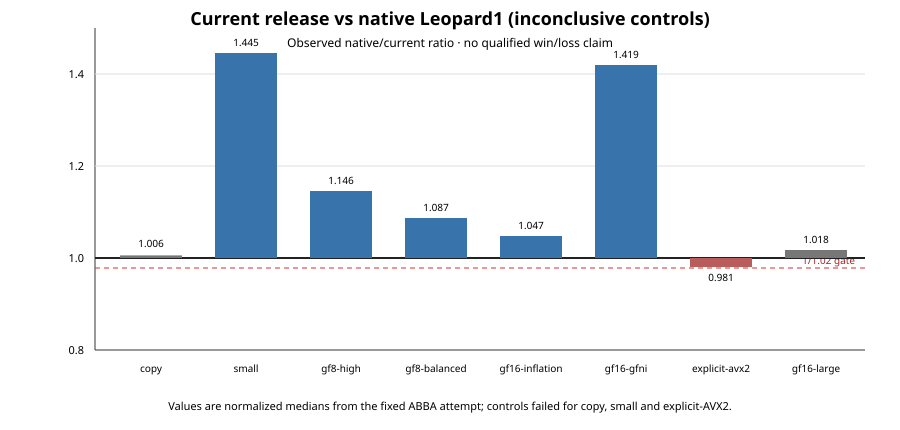

# Current-release native encode timing (v1)

This is a retained measurement from the preregistration/attempt commit
`15756b1`; the candidate Leopard2 codec is `e35b1f0c3a5ef9f241ad3b174b0fbfdb61bbccab`
(`e35b1f0`), with original native
Leopard1 `6e5725ebdf9da4370b0bcc4f70fa8eb66f4e6198`. It uses the eight fixed
workloads in the repository-only `experiments/leopard2/native_release/timing_plan_v1.json`
and the original native Leopard1 build. The run was on an AMD Ryzen
Threadripper 9980X (family 26/model 8), one worker (CPU 52), its sibling 116
held idle, and controller CPU 0.

The one preregistered attempt completed all 16 clock-free preflights and 288
measured processes (three ABBA rounds per cell). It used 256 MiB and no swap;
peak was 148,623,360 bytes, with all memory-event and swap counters zero.
Normal and `python -O` replay agree byte-for-byte. Raw evidence is retained in
the repository-only campaign bundle recorded by the Beads task.

## Result

The fixed same-binary controls failed for `copy`, `small`, and
`gf16-explicit-avx2` (the required aggregate interval is `[1/1.02, 1.02]`).
Consequently the preregistered decision is **`inconclusive_controls`** and no
cell is a qualified performance win or loss. The ratios below are descriptive
raw observations only. For a `native/current` ratio, values above one would
nominally favor the current build and values below one would nominally favor
native Leopard1; that directional reading is not a release claim here.

| Workload | Native/current ratio | Same-native control | Same-current control | Native/current round ratios |
|---|---:|---:|---:|---|
| copy | 1.005571252 | 0.931792699 | 0.958931651 | 1.044031, 1.013240, 0.961198 |
| small | 1.444727622 | 1.025749195 | 1.029676235 | 1.455507, 1.420266, 1.458727 |
| gf8-high | 1.145910717 | 1.000957825 | 1.007184840 | 1.129270, 1.154802, 1.153843 |
| gf8-balanced | 1.086963424 | 1.008330183 | 1.017046107 | 1.048518, 1.111111, 1.102329 |
| gf16-inflation | 1.046723741 | 0.996955476 | 1.001186465 | 1.048654, 1.044413, 1.047109 |
| gf16-gfni-region | 1.419086142 | 1.005741405 | 0.999746471 | 1.384035, 1.463168, 1.411189 |
| gf16-explicit-avx2 | 0.981453525 | 0.999679532 | 0.978774395 | 0.970624, 0.978368, 0.995534 |
| gf16-large | 1.017872202 | 0.998302675 | 0.998891830 | 1.016155, 1.017178, 1.020288 |

The timed boundary is ordinary public full encode with setup, allocation,
input generation, poisoning, parity copies and hashing excluded. API result
checks, loop and timer-adapter overhead are included. Each process used four
warmups and nine measured groups, each at least 20 ms. This is not setup,
one-shot latency, decoding, total process memory, or an operation-specific ISA
attestation. No production selector was changed and no route was promoted.

Reproduction requires the exact pinned artifacts and host-specific plan; the
repository-only raw bundle is intentionally excluded from source archives.
Do not pool this attempt with earlier timing experiments or retry it with a
different schedule.
